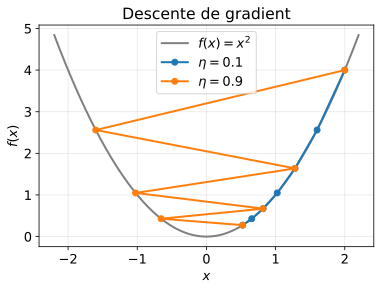

# Optimisation convexe

Cours d'exemple pour tester l'affichage : formules, équation très large, tableau, code.

## Ensembles et fonctions convexes

**Définition 1 (Fonction convexe).** Une fonction $f : \mathbb{R}^n \to \mathbb{R}$ est *convexe* si pour tous $x, y$ et tout $\lambda \in [0,1]$ :

$$
f(\lambda x + (1-\lambda) y) \le \lambda f(x) + (1-\lambda) f(y).
$$

Une fonction deux fois dérivable est convexe si et seulement si sa hessienne $\nabla^2 f(x)$ est semi-définie positive pour tout $x$. Les indices comme $x_k$ ou $w_{t+1}$ ne doivent pas être pris pour de l'italique.

> **Piège :** une fonction convexe n'est pas forcément dérivable, par exemple $f(x) = |x|$ en $x = 0$.

## Descente de gradient

On part de $x_0$ et on itère avec un pas $\eta > 0$ :

$$x_{k+1} = x_k - \eta \nabla f(x_k)$$



**Théorème 1.** Si $f$ est convexe et $L$-lisse, avec $\eta = 1/L$, alors

$$
f(x_k) - f(x^\star) \le \frac{L \lVert x_0 - x^\star \rVert^2}{2k}.
$$

Équation volontairement très large, qui doit défiler sur le côté sans rétrécir :

$$
\mathcal{L}(w, b, \alpha) = \frac{1}{2}\lVert w \rVert^2 - \sum_{i=1}^{n} \alpha_i \left[ y_i \left( w^\top x_i + b \right) - 1 \right] + \sum_{i=1}^{n} \beta_i \xi_i + C \sum_{i=1}^{n} \xi_i - \sum_{i=1}^{n} \mu_i \xi_i + \lambda \lVert w \rVert_1
$$

### Choix du pas

| Pas $\eta$ | Comportement |
|---|---|
| trop petit | convergence lente |
| $\eta = 1/L$ | convergence garantie |
| trop grand ($\eta > 2/L$) | divergence possible |

## En pratique

```python
def descente(grad, x, eta=0.1, n=100):
    for _ in range(n):
        x = x - eta * grad(x)
    return x
```

Le prix affiché est de 5 $ (un dollar seul ne doit pas lancer une formule).
